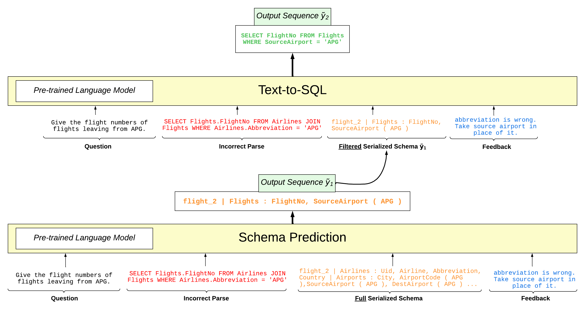

# DestT5 (Correcting Semantic Parses with Natural Language through Dynamic Schema Encoding)
Dataset for DestT5 (NLP for ConvAI, ACL 2023)



Contains 112 annotations for interactive semantic parsing.

Given randomly selected errors on the [Spider](https://github.com/taoyds/spider) dataset by [tscholak/3vnuv1vf](https://huggingface.co/tscholak/3vnuv1vf), natural language feedback is given to correct the erroneous parse.  

If you use this dataset or repository, please cite the following paper:

```
@inproceedings{glenn2023correcting,
  author = {Parker Glenn, Parag Pravin Dakle, Preethi Raghavan},
  title = "Correcting Semantic Parses with Natural Language through Dynamic Schema Encoding",
  booktitle = "Proceedings of the 5th Workshop on NLP for Conversational AI",
  publisher = "Association for Computational Linguistics",
  year = "2023"
}
```